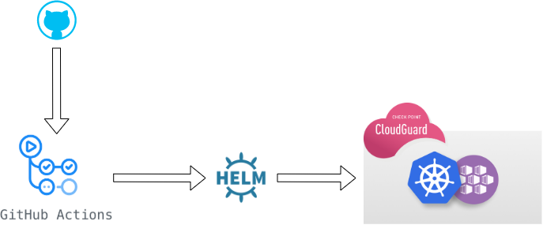

# Kubernetes + Cloudguard
Written by Michael Braun

    

    

This is a Helm Chart that deploys the OWASP Juice Shop application and Cloudguard WAAP.  

<b>Credit to Mark Nichols for assisting me with Helm.</b> I "borrowed" a lot from his project, located [HERE](https://github.com/mnichols62/cpWaapJuice).  

This deployment can be done directly on an AKS Cluster or with Github Actions to deploy AKS, Juice Shop and Log.IC. These instructions will outline how to deploy using a CI/CD pipeline.   

The build pipeline performs the following actions: 

1. Login to Azure and create AKS cluster 
2. Package Helm Chart 
3. Deploy Helm Chart to AKS 
4. Add K8 account to Check Point CSPM 
5. Deploy Check Point CPSM Helm Chart for onboarding. 

The destroy pipeline performs the following actions:  
1. Deletes the Azure environment created by the build pipeline<be>
2. Removes the K8 account from CSPM 

<b> Get started by Forking this responsitory!</b>

## Prerequisites

