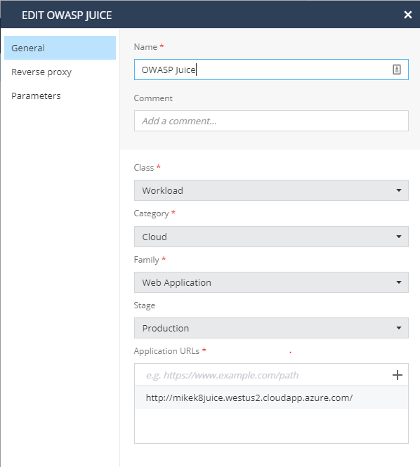

# Kubernetes + Cloudguard
Written by Michael Braun


<p align="left">
    
</p>    

This is a Helm Chart that deploys the OWASP Juice Shop application and Cloudguard WAAP. <br>

<b>Credit to Mark Nichols for assisting me with Helm.</b> I "borrowed" a lot from his project, located [HERE](https://github.com/mnichols62/cpWaapJuice). <br>

This deployment can be done directly on an AKS Cluster or with Github Actions to deploy AKS, Juice Shop and Log.IC. These instructions will outline how to deploy using a CI/CD pipeline. <br><br>


The build pipeline performs the following actions:<br>

1. Login to Azure and create AKS cluster<br>
2. Package Helm Chart<br>
3. Deploy Helm Chart to AKS<br>
4. Add K8 account to Check Point CSPM<br>
5. Deploy Check Point CPSM Helm Chart for onboarding.<br>

The destroy pipeline performs the following actions: <br>
1. Deletes the Azure environment created by the build pipeline<be>
2. Removes the K8 account from CSPM<br>

<b> Get started by Forking this responsitory!</b>

## Prerequisites
In order to run this demo, you need the following:

[Github Account](https://github.com) <br>
[Azure Account](https://portal.azure.com) <br>
[Check Point Cloud Security Posture Management Account](https://secure.dome9.com/) <br>
[Check Point Cloud Portal](https://portal.checkpoint.com) -  WAAP Token <br>

## Setup

For all components in this demo to work, you must have Log.IC enabled for Kubernets in Check Point CSPM. <br><br>
<b> Note: This was designed for Check Point employees.</b> If you want to run the CI/CD pipeline and you are not a Checkpoint employee, you will need to modify line 58 in the [build.yml](.github/workflows/build.yml)

### Microsoft Azure

Create an App Registration in Azure. As this will be used multiple times, please note the following:

- Application (client) ID <br>
- Directory (tenant) ID <br>
- Secret <br>
- Subscription ID <br>

Ensure that you give this app registration "Contributor" permission. 

### Setup Github Environment

Start by enabling workflows in the "Actions" tab. <br>

Examing the [build.yml](.github/workflows/build.yml) file. You must create secrets for each one of the variables.

```
      WAAP_TOKEN: ${{ secrets.WAAP_TOKEN }}
      CSPM_API: ${{ secrets.CSPM_API }}
      CSPM_SECRET: ${{ secrets.CSPM_SECRET }}
      AZURE_SUBSCRIPTION_ID: ${{ secrets.AZURE_SUBSCRIPTION_ID }}
      AZURE_TENANT_ID: ${{ secrets.AZURE_TENANT_ID }}
      AZURE_CLIENT_ID: ${{ secrets.AZURE_CLIENT_ID }}
      AZURE_CLIENT_SECRET: ${{ secrets.AZURE_CLIENT_SECRET }}
      AZ_RG: ${{ secrets.AZ_RG }}
      AZ_LOCATION: ${{ secrets.AZ_LOCATION }}
      URL_SUFFIX: ${{ secrets.URL_SUFFIX }}
      CLUSTER_NAME: ${{ secrets.CLUSTER_NAME }}
      K8_CSPM_NAME: ${{ secrets.K8_CSPM_NAME }}
      NAMESPACE: ${{ secrets.NAMESPACE }}
      ORG_NAME: "WAAP_JUICE_K8"
```
#### Variable Functions

WAAP_TOKEN: The token generated for WAAP in the Infinity Next console.<br>
CSPM_API: API Key for CSPM <br>
CSPM_SECRET: API Secret for CSPM <br>
AZURE_SUBSCRIPTION_ID: Azure Subscription ID <br>
AZURE_TENANT_ID: Azure Tenant ID <br>
AZURE_CLIENT_ID: Azure Client ID <br>
AZURE_CLIENT_SECRET: Azure Client Secret <br>
AZ_RG: Name of the resource group to be created <br>
AZ_LOCATION: Azure region for resources to be built in. Ex: West US 2 <br>
URL_SUFFIX: This must have a value of: cloudapp.azure.com <br>
CLUSTER_NAME: Define a name for the K8 cluster<br>
K8_CSPM_NAME: Define a name for the object within CSPM <br>
NAMESPACE: Define a namespace <br>
ORG_NAME: This will be the name of the organizational unit created within CPSM <br>

## Build the Environment

Modify the _build_flag and commit the changes to trigger a build. Once complete, you will be able to access the new website at the following address:<br>

YOUR_NAMESPACE.YOUR_LOCATION.cloudapp.azure.com

## Enable WAAP Protections

To enable the protections, you need to update the asset within WAAP. Got to Environment > Assets and update the URL to the value defined above.



Once complete, click on "Enforce" and you will be protected. <br>

Configuring WAAP is outside the scope of this article. Documentation for that can be found [HERE](https://sc1.checkpoint.com/documents/Infinity_Portal/WebAdminGuides/EN/Infinity-Next-Admin-Guide/Topics-Infinity-Next/Overview-Infinity-Next.htm) <br>

## CSPM

Understanding the full capabilities of Check Point CSPM is outside the scope of this article. Please review the documentation located [HERE](https://sc1.checkpoint.com/documents/CloudGuard_Dome9/Documentation/DocHome.html?TocPath=_____1)<br>

I would like to have you examine the Log.IC tab and select the newly created K8 account. This is what you will see:


## Cleanup

To remove the deployment, modify the _destroy_flag and commit the changes.


